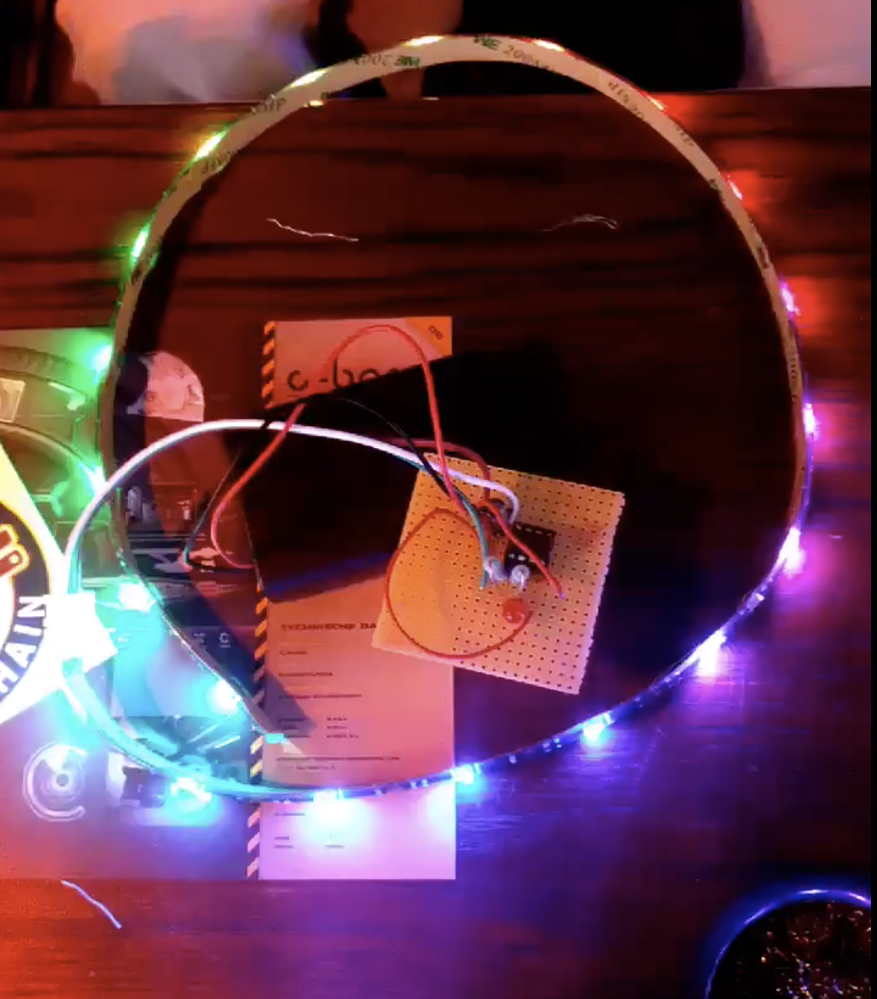
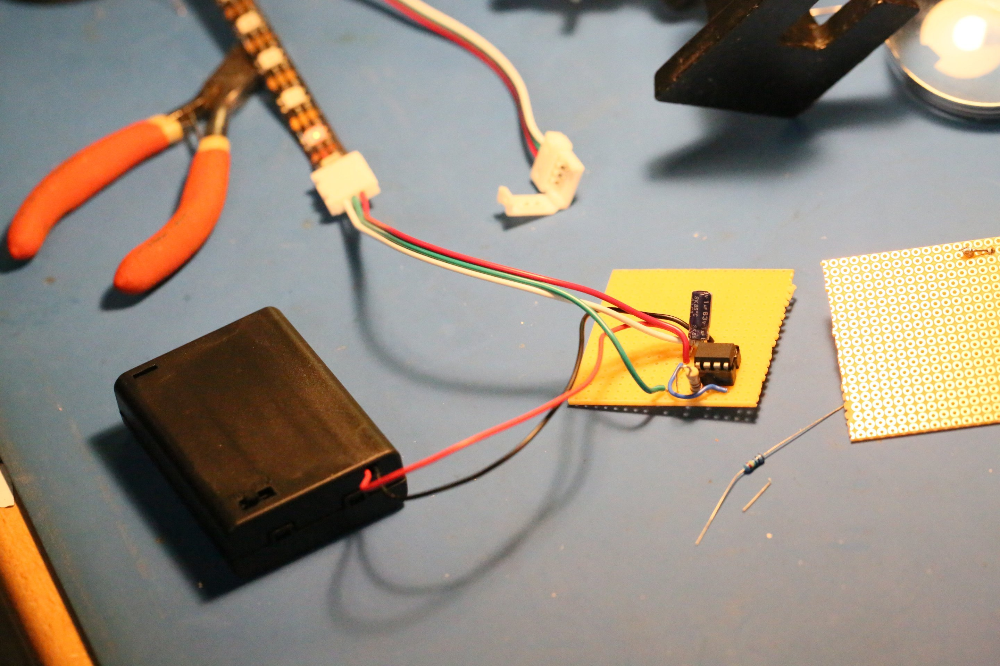

# tinyPixelFun
Bauanleitung für einen ATTiny85 basierten WS2812b Kontroller. Eine Reihe an Beispielen veranschaulichen was der ATtiny85 so kann.

# Arduino IDE Erweiterungen

https://raw.githubusercontent.com/damellis/attiny/ide-1.6.x-boards-manager/package_damellis_attiny_index.json

# Bauteile

## Basis Set

* ATtiny85 20MHz
* 8 Pin IC Sockel
* WS2812b RGB LED Stripe (3 Kabel)
* 3x AA Batteriefach
* 3x AA Batterien
* 1x 10uF Kondensator
* 1x 220 Ohm Vorwiderstand
* 1x 5x5cm Streifenraster Platine 
* 1x WS2812b Anschlussklemme mit Kabel (3 Kabel)
* Kosten ca. 5-6 Eur

## Option 1
* 1x 220 Ohm Vorwiderstand
* 1x LED (bel. Farbe)
* Kosten ca. 0,30 Eur

## Option 2
* 1x Taster
* 1x 10k Pullup Widerstand 
* Kosten ca. 0,30 Eur

## Bauanteilung (noch in Bearbeitung)

Hier findest Du die Anleitung zum Aufbau der Schaltung:
* [Bauanleitung](https://htmlpreview.github.io/?https://github.com/dermicha/tinyPixelFun/blob/master/Bauanleitung/html/index.html)

## Examples

### SimpleBlink 

Ganz einfaches Beispiel. Eine Standard LED wird zum blinken gebracht. 

### BouncinBalls

Mit ein wenig Physik werden Bälle zum hüpfen gebracht. Mit Option 2 kann die Anzahl der Bälle verändert werden.

### MZ1DPong

Erste Version eines 1D Pong Spiels. Dieses Spiel benötigt 2 Taster, für jeden Spieler einen (2x Option 2).  
